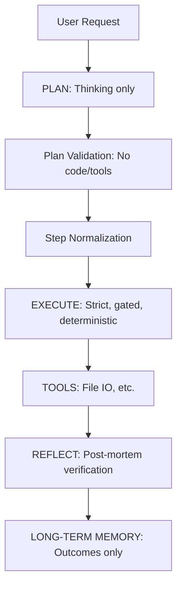

# Controlled LLM Execution Engine

> **A deterministic, artifact-first LLM execution framework that strictly separates thinking from doing.**

This project is **not** a typical "AI agent". It is a controlled execution engine that uses an LLM as a planner and operator under explicit system rules.

---

##  Why this exists

Most LLM-based agents fail because they:
* Mix reasoning and execution.
* Write files without permission.
* Hallucinate success.
* Rely on prompt obedience instead of system control.

This project solves that by enforcing:
* **Strict phase separation.**
* **Deterministic execution.**
* **Explicit artifact intent.**
* **Verifiable outcomes.**

---

It looks like the Markdown renderer (likely GitHub or VS Code) is failing because the closing code fence (```) for the Mermaid block was missing or merged with the next block in your file.

Here is the **fixed** Architecture section. You can replace the broken section in your `README.md` with this exactly:

```markdown
## 🏗️ Architecture Overview

The system operates on a strictly gated pipeline. Each phase has hard rules; violations cause a "fail fast" response.



```text
User Request
     ↓
PLAN (Thinking only)
     ↓
Plan Validation (no code, no tools)
     ↓
Step Normalization (executable vs non-executable)
     ↓
EXECUTE (strict, gated, deterministic)
     ↓
TOOLS (file IO etc.)
     ↓
REFLECT (post-mortem verification)
     ↓
LONG-TERM MEMORY (outcomes only)

```

---

##  Core Design Principles

### 1. PLAN ≠ EXECUTE

* Planning is **text-only**.
* Execution is **tool-only**.
* The model never decides *when* to act.

### 2. Artifact-First Execution

* Every executable step must map to a concrete artifact.
* **No artifact → no execution.**
* This prevents vague or hallucinated actions.

### 3. Deterministic State Machine

* Execution progresses step-by-step.
* **No recursion.**
* **No infinite loops.**
* No hidden autonomy.

### 4. Reflection is Verification

* Must reference real artifacts.
* Must indicate persistence or completion.
* No planning, no theory, no "success claims" without proof.

### 5. Long-Term Memory Without Contamination

* Stores **outcomes only**, never reasoning.
* Used only to bias future planning.
* Never affects execution directly.

---

##  Features

* Strict PLAN / EXECUTE / REFLECT separation
* Planner output validation (no code leakage)
* Executable vs non-executable step normalization
* Automatic artifact intent inference
* Controlled tool execution (1 tool per step)
* Safe read → write chaining
* Reflection validation
* Long-term memory (artifact-centric)
* FastAPI wrapper

---

##  Example Flow

**Input:**

> "Generate the Fibonacci sequence up to n and save it to a file."

**1. Plan:**

```text
1. Analyze the requirements.
2. Design the approach.
3. Define the sequence generation logic.
4. Save the generated sequence to a file.

```

**2. Execution:**

* *Non-executable steps are skipped.*
* *Artifact intent inferred (`output.txt`).*
* *File write is explicitly authorized.*

**3. Reflection:**

> "The output was saved to output.txt, completing the task."

**4. Memory:**

```json
{
  "Task": "Generate Fibonacci sequence",
  "Artifact": "output.txt"
}

```

---

##  Tools Supported

Currently implemented:

* `read_file(path)`
* `write_file(path, content)`

*Tool usage is explicitly gated, validated, and recorded by the orchestrator.*

---

##  API Usage

### Start the server

```bash
uvicorn api.app:app --reload

```

### Run a task

```bash
curl -X POST [http://127.0.0.1:8000/run](http://127.0.0.1:8000/run) \
  -H "Content-Type: application/json" \
  -d '{"task": "Generate the Fibonacci sequence up to n and save it to a file."}'

```

### Response

```json
{
  "task": "Generate the Fibonacci sequence up to n and save it to a file.",
  "steps_completed": 4,
  "total_steps": 4,
  "artifacts": ["output.txt"],
  "reflection": "The output was saved to output.txt, completing the task."
}

```

---

##  What this is NOT

This system does not trust the model. It trusts state, rules, and verification.

* **Not** an AutoGPT-style agent
* **Not** prompt-driven execution
* **Not** autonomous or self-directing
* **Not** a chatbot that writes files freely

---

## Intended Extensions

This engine is designed to safely support:

* AI design councils (Architect / Critic / Synthesizer).
* User consent gates for code generation.
* Real computation tools.
* IDE / editor integration.
* Confidence scoring and audits.

*All without weakening control.*

---

## Inspiration

Inspired by:

* Compiler pipelines.
* Workflow engines.
* Production incident postmortems.
* Failures of uncontrolled agent systems.

---

## Status

**Core engine complete and stable.**
Future work focuses on capabilities, not autonomy.

```

```